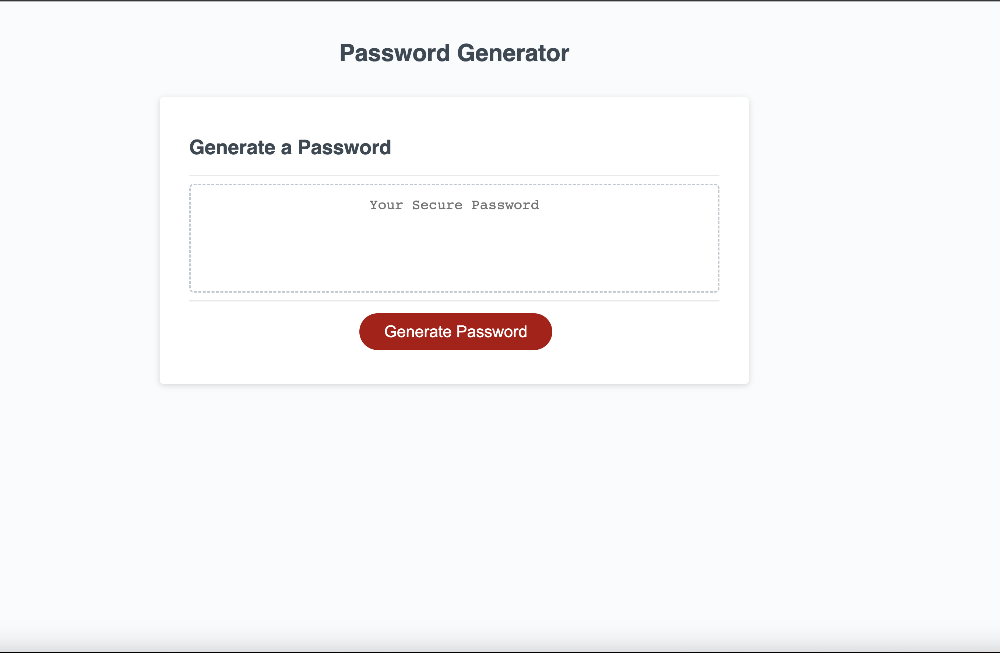
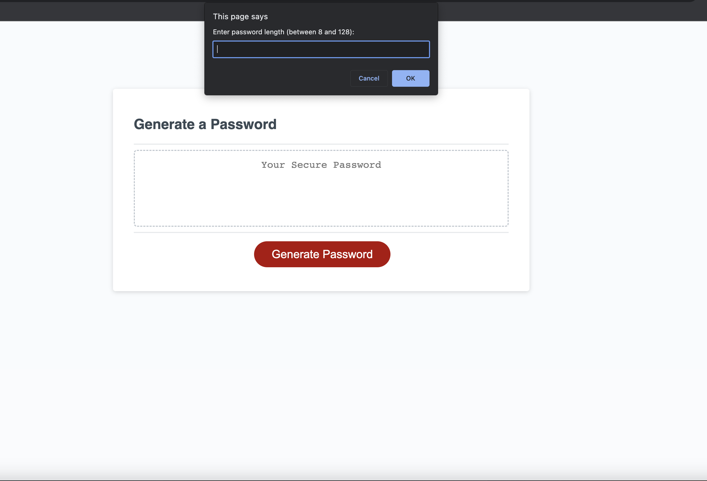
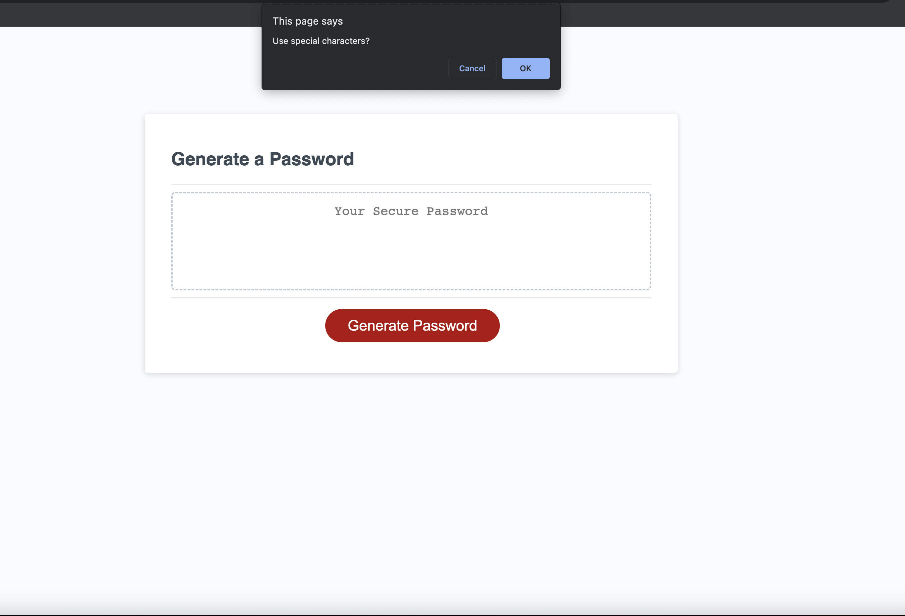
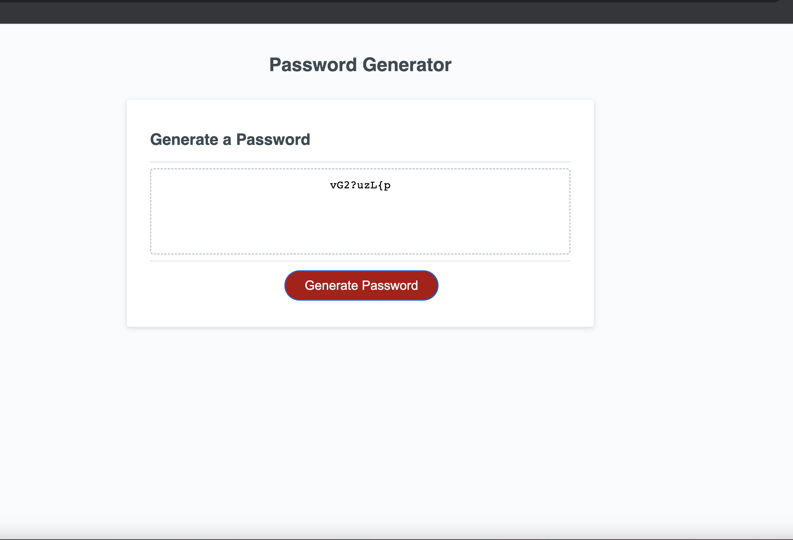

# 03 JavaScript: Password Generator

# Generate random passwords

## Description

Create an application that enables employees to generate random passwords based on criteria that they’ve selected

## Installation

Make a function to generate a password that do :
1-Difine the criterias that will be chosen like lowercase, uppercase, numeric, and/or special characters.
2-Ask the user about the length of the password and make sure it's between 8 and 128 characters.
3-Confirm the criterias that will be chosen to generate the random password and make sure the user chose at least one criteria.
4-Make sure the password has at least one character type.
5-Generate the remaining password rondomly from the selected criterias.

Execute the function when click the button to generate a password.

## Usage

Included screenshots shows the usage and the deployed URL.

[Generate a password application URL](https://mahmoudahmed0528.github.io/Passord-Generator/)
